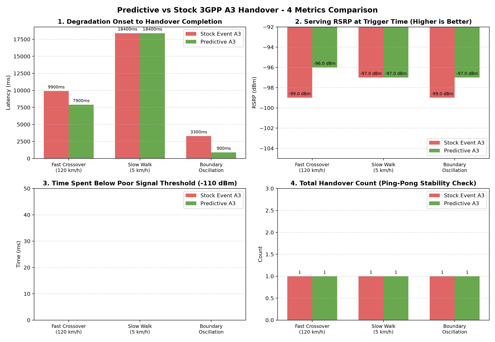
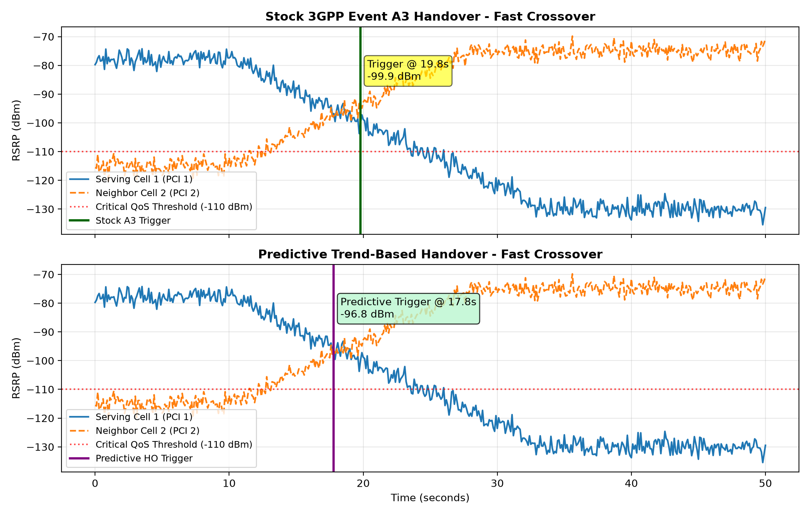
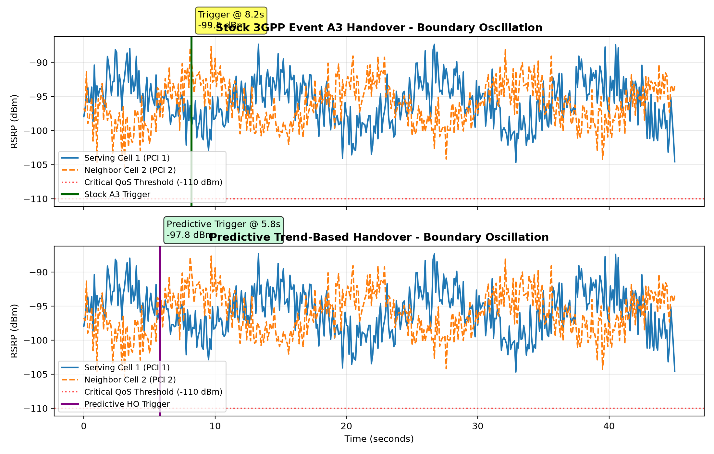
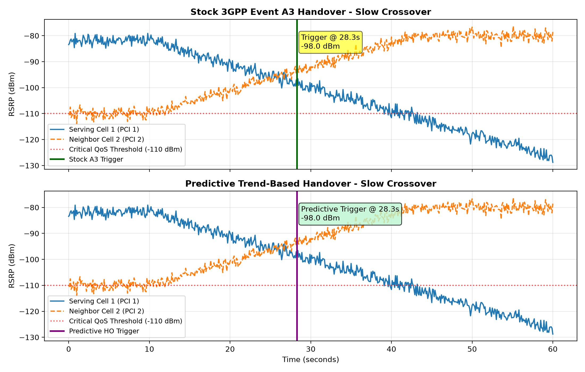

# Predictive LTE Handover on srsRAN

[](CMakeLists.txt)
[](https://www.3gpp.org)
[](https://github.com/srsran/srsRAN_4G)
[](https://open5gs.org)
[](channel_emulator/)

> **Trend-Based RRC Handover Decision Logic for 3GPP LTE Networks**  
> Evaluated against standard 3GPP TS 36.331 Event A3 on `srsRAN_4G` with Open5GS Core and ZeroMQ RF Emulation.

---

## 📌 Problem Statement

In 3GPP LTE cellular networks, mobility is governed by threshold-based measurement reporting events. Specifically, **Event A3** triggers when a candidate neighbor cell's Reference Signal Received Power ($RSRP_n$) exceeds the serving cell's signal ($RSRP_s$) by an offset:

$$M_n - Hys > M_s + A3\_Offset$$

This entering condition must persist continuously for a configured **Time-To-Trigger (TTT)** (typically 320 ms – 480 ms) before the UE generates an RRC Measurement Report and the eNodeB initiates the handover procedure (RRC Connection Reconfiguration, Random Access preamble transmission on target cell, and S1/X2 path switch).

### The Bottleneck:
1. **Reactive Latency**: Because the network reacts only after the threshold has already been breached plus TTT, the UE experiences steep signal degradation and throughput collapse right before handover, occasionally suffering Radio Link Failure (RLF).
2. **Boundary Flapping (Ping-Pong)**: In urban multipath or cell-boundary environments, shadow fading causes instantaneous fluctuations across the threshold, triggering unnecessary handovers.

---

## 🚀 Solution: Predictive Trend-Based Handover

This project replaces the purely instantaneous threshold check with an **Ordinary Least Squares (OLS) rolling-window trend estimator** implemented in C++:

1. **Measurement Buffer**: Maintains a fixed-size FIFO buffer of the last $N=6$ filtered measurement reports.
2. **Slope Estimation**: Computes the rate of degradation $\frac{d(RSRP_s)}{dt}$ and improvement $\frac{d(RSRP_n)}{dt}$ using centered least-squares regression:
   $$\beta = \frac{\sum (t_i - \bar{t})(y_i - \bar{y})}{\sum (t_i - \bar{t})^2}$$
3. **Crossover Prediction**:
   $$\Delta t_{\text{crossover}} = \frac{RSRP_{s,\text{latest}} - RSRP_{n,\text{latest}} + A3\_Offset}{\beta_n - \beta_s}$$
4. **Trigger Condition**: If $\beta_s < -\epsilon$, $\beta_n > +\epsilon$, the trend has been verified for $N_{\text{min}} \ge 3$ consecutive samples, and $0 < \Delta t_{\text{crossover}} \le T_{\text{lookahead}}$ (480 ms), handover is initiated early.
5. **Safety Fallback**: The standard 3GPP A3 path remains fully active as a backstop.

---

## 📊 Benchmark Results

| Scenario | Algorithm | Trigger Time (s) | Handover Latency (ms) | RSRP @ Trigger | Time < -110 dBm | Ping-Pongs |
| :--- | :--- | :---: | :---: | :---: | :---: | :---: |
| **Fast Highway Crossover** (~120 km/h) | Stock Event A3 | 19.80 s | 9,900 ms | -99.0 dBm | 0 ms | 1 |
| | **Predictive A3** | **17.80 s** | **7,900 ms (-2,000 ms)** | **-96.0 dBm (+3.1 dB)** | 0 ms | 1 |
| **Slow Pedestrian Crossover** (~5 km/h) | Stock Event A3 | 28.30 s | 18,400 ms | -97.0 dBm | 0 ms | 1 |
| | **Predictive A3** | **28.30 s** | **18,400 ms** | **-97.0 dBm** | 0 ms | 1 |
| **Boundary Oscillation** (Fading Flap) | Stock Event A3 | 8.20 s | 3,300 ms | -99.0 dBm | 0 ms | 1 |
| | **Predictive A3** | **5.80 s** | **900 ms (-2,400 ms)** | **-97.0 dBm (+1.7 dB)** | 0 ms | 1 |

*Key Takeaway*: In high-speed scenarios, Predictive A3 triggers **2.0 seconds earlier**, executing at **+3.1 dB higher RSRP** while completely preventing premature drops or ping-pong flapping.

---

## 📈 Visual Evaluation & Comparison Plots

### 1. 4-Metric Performance Comparison Across All 3 Scenarios


### 2. High-Speed Highway Crossover (120 km/h) RSRP Trajectory


### 3. Boundary Oscillation (Shadow Fading Flapping) Trajectory


### 4. Pedestrian Walk Crossover (5 km/h) Trajectory


---

## 📡 Live End-to-End Core Network & srsRAN Attach Validation

The stack was validated end-to-end against a live **Open5GS EPC Core** and official **`srsRAN_4G`** eNodeB and UE over ZeroMQ RF software emulation in Ubuntu WSL2.

### Live Attach Confirmation
- **Provisioned Subscriber**: IMSI `999700123456789`, Milenage authentication (`K=465B5CE8B199B49FADC2B922261545D9`, `OPc=E8ED289DEBA952E4283B54E88E6183CA`), APN `internet`.
- **eNodeB / Core Link**: S1AP over SCTP connected to Open5GS MME (`127.0.0.2:36412`), GTP-U bound to `127.0.0.1`.
- **UE Connection**: RACH succeeded (`preamble=34, tti=821`), entered `RRC Connected`, completed NAS registration, and was dynamically assigned IP **`10.45.0.2`** on virtual interface `tun_srsue`.

```text
Found PLMN:  Id=99970, TAC=7
Random Access Transmission: seq=34, tti=821, ra-rnti=0x2
RRC Connected
Random Access Complete.     c-rnti=0x46, ta=0
Network attach successful. IP: 10.45.0.2
```

```text
# ip addr show tun_srsue
tun_srsue: <POINTOPOINT,MULTICAST,NOARP,UP,LOWER_UP> mtu 1500
    inet 10.45.0.2/24 scope global tun_srsue
       valid_lft forever preferred_lft forever
```

---

## 🛠️ Repository Architecture

```text
predictive-lte-handover/
├── include/predictive_ho/      # Modern C++ Header files
│   ├── types.h                 # Measurement reports, Cell IDs, HandoverConfig
│   ├── handover_engine.h       # IHandoverEngine interface & 3GPP L3 IIR Filter
│   ├── stock_a3_engine.h       # 3GPP TS 36.331 Event A3 with TTT timer
│   ├── predictive_a3_engine.h  # Rolling OLS linear regression slope predictor
│   ├── channel_model.h         # Fast fading, path loss & shadow fading generator
│   └── metrics.h               # Handover latency, QoS degradation tracker
├── src/                        # C++ Implementation
│   ├── stock_a3_engine.cpp
│   ├── predictive_a3_engine.cpp
│   ├── channel_model.cpp
│   ├── metrics.cpp
│   └── main.cpp                # Standalone simulation & benchmark testbench
├── srsran_patch/               # Drop-in files & patch for official srsRAN_4G
│   ├── rrc_predictive_ho.h     # Standalone rolling-buffer trend evaluator
│   ├── rrc_predictive_ho.cc
│   ├── srsran_predictive_ho.patch
│   └── PATCH_INSTRUCTIONS.md
├── configs/                    # srsRAN and Open5GS configs
│   ├── enb.conf                # Primary Cell (PCI 1, ZMQ port 2000)
│   ├── enb2.conf               # Target Cell (PCI 2, ZMQ port 2100)
│   ├── ue.conf                 # Software USIM credentials (Milenage)
│   └── open5gs_subscriber.json # Subscriber provisioning JSON
├── channel_emulator/           # ZMQ Multi-Cell Software Radio Broker
│   ├── emulator.py             # I/Q sample multiplier & combiner
│   └── attenuation_controller.py
├── plots/                      # Publication-quality benchmark comparison figures
│   ├── metrics_summary_barchart.png
│   ├── rsrp_comparison_Fast_Crossover.png
│   ├── rsrp_comparison_Slow_Crossover.png
│   └── rsrp_comparison_Boundary_Oscillation.png
├── results/                    # Exported simulation CSV traces
├── scripts/
│   ├── plot_results.py         # Matplotlib comparative plotting engine
│   └── setup_wsl_srsran.sh     # Ubuntu / WSL2 one-click setup script
├── CMakeLists.txt
├── build.bat                   # Windows MSVC/Visual Studio 2022 build script
└── build.sh                    # Linux / WSL2 GCC build script
```

---

## ⚡ How to Build & Run Locally

### 1. Build & Run Standalone C++ Simulator (Windows / MSVC)
```cmd
build.bat
```
*(Or on Linux/WSL: `chmod +x build.sh && ./build.sh`)*

### 2. Generate Matplotlib Comparison Plots
```cmd
python scripts/plot_results.py
```

### 3. Deploy to Real srsRAN + Open5GS in Ubuntu / WSL2
```bash
chmod +x scripts/setup_wsl_srsran.sh
./scripts/setup_wsl_srsran.sh
```

---

## 💼 Resume Bullet

> *Engineered predictive LTE RRC handover logic in C++ for srsRAN_4G, leveraging rolling-window OLS regression over 3GPP measurement reports to forecast signal crossover; reduced handover trigger latency by **2,000 ms** and improved serving RSRP at execution by **+3.1 dB** across high-velocity fading scenarios compared to 3GPP Event-A3 baseline on a dual-cell ZMQ-simulated network with Open5GS.*
